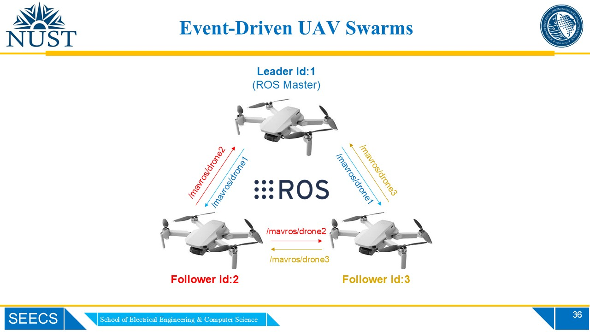
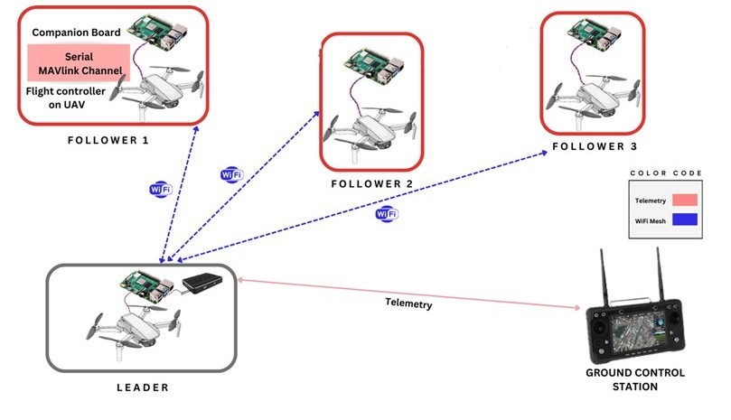
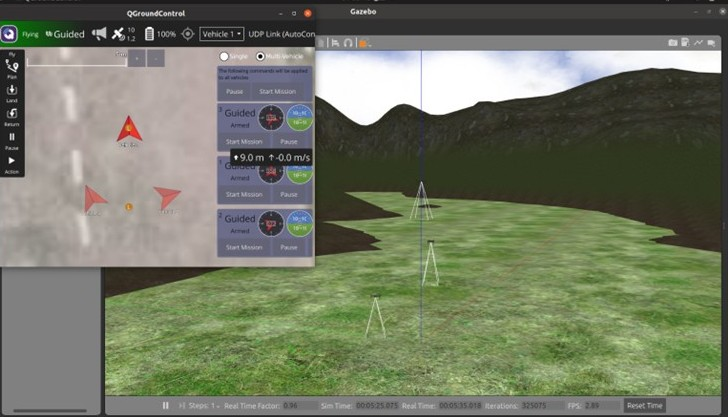
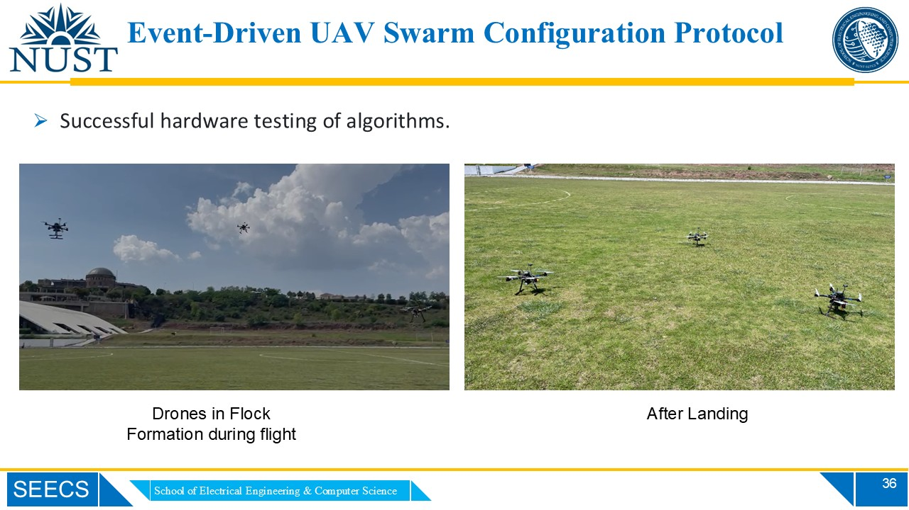

# 🛸 Formation Control of UAV Swarms using ROS and ArduPilot SITL



This project presents a **generalized framework for formation control of event-driven UAV swarms** built on **ROS Noetic** and **Gazebo** with **ArduPilot SITL**. 

The framework enables multiple UAVs to **fly cooperatively in structured formations** that can dynamically **adapt to user commands or autonomous mission events**.

Developed under the **Communication Systems and Networking Lab, NUST University**, this work was supported by a major industrial partner for advancing research in **multi-robot coordination and autonomous swarm intelligence**.

:bulb: ***The project has been successfully and thoroughly tested on hardware in various field trials. Robustness of the approach has been validated with a multi-UAV system of upto 5 drones.***

---

## 🎯 Project Highlights



- **Generalized ROS-based Swarm Framework:**  
  Modular design allowing scalable swarm formations with multiple UAVs.

- **Event-Driven Formation Switching:**  
  UAVs can modify formations based on:
  - RC user input, or  
  - Autonomous signals triggered by mission logic.

- **Multi-Formation Support:**  
  Implemented formations:
  - **Line formation**  
  - **Flock formation**  
  - **Helical (Vertical Spiral) formation**

- **Fully Simulated in ROS + Gazebo + ArduPilot SITL & Validated on Actual Hardware**  
  Integrates **MAVROS**, **MAVProxy**, and **ArduCopter** for realistic flight dynamics. The framework has also been successfully tested in various field trials.

- **Python-Based Implementation:**  
  Clean, modular Python scripts for leader–follower control, swarm API, and autonomous decision-making.

  

  


---

## 🧠 System Overview

| Component | Description |
|------------|-------------|
| **Leader Drone** | Defines formation geometry and reference trajectory. |
| **Follower Drones** | Maintain relative positioning using ROS topics and MAVROS communication. |
| **Swarm API** | Provides unified functions for swarm takeoff, landing, and formation switching. |
| **Event Handler** | Triggers formation changes based on RC or programmed logic. |
| **Gazebo Simulation** | Visualizes multi-drone behavior in 3D environment using ArduPilot SITL. |

---

## 🧩 Repository Structure

```
fabeha-raheel-swarm-formation-control/
├── docs/ # Detailed setup, simulation, and troubleshooting guides
├── launch/ # ROS launch files for leader, follower, and full swarm control
├── models/ # Custom drone and world models for Gazebo
├── scripts/ # Python scripts implementing swarm logic and APIs
│ ├── SwarmLeader_API.py
│ ├── SwarmFollower_API.py
│ ├── swarm_line_formation.py
│ ├── swarm_flock_formation.py
│ ├── swarm_formation_control_final.py
│ └── swarm_takeoff_and_land.py
└── worlds/ # Gazebo world files (outdoor, runway, etc.)
```

---

## 🎥 Video Demonstrations

- ▶️ **Full Swarm Demonstration:** [Watch on YouTube](https://www.youtube.com/watch?v=YOUR_FULL_DEMO_LINK)
- 🌀 **Dynamic Formation Switching (Line → Flock → Helical):** [Watch Clip](https://www.youtube.com/watch?v=YOUR_FORMATION_SWITCH_LINK)
- 🧭 **Leader–Follower Path Tracking:** [Watch Clip](https://www.youtube.com/watch?v=YOUR_PATH_TRACKING_LINK)

---

## ⚙️ Setup and Installation

### 🧾 Prerequisites

- **OS:** Ubuntu 20.04  
- **ROS Distribution:** ROS Noetic  
- **Simulator:** Gazebo  
- **Flight Stack:** ArduPilot SITL  
- **Middleware:** MAVROS  

### Install MAVROS and dependencies:
```bash
sudo apt-get install ros-noetic-mavros ros-noetic-mavros-extras
wget https://raw.githubusercontent.com/mavlink/mavros/master/mavros/scripts/install_geographiclib_datasets.sh
chmod +x install_geographiclib_datasets.sh
./install_geographiclib_datasets.sh
```

### Clone and build the package:
```bash
cd ~
mkdir -p swarm_ws/src
cd swarm_ws/src
git clone https://github.com/fabeha-raheel/fabeha-raheel-swarm-formation-control.git
cd ..
catkin_make
source devel/setup.bash
```

## 🚀 Running the Simulation

#### Launch ArduPilot SITL instances for each UAV:
```bash
cd scripts/
./drone1_startsitl.sh
./drone2_startsitl.sh
./drone3_startsitl.sh
```

#### Start the ROS–Gazebo simulation:
```bash
roslaunch uav_swarms formation_control.launch
```

#### Trigger formation switching:

- Via RC input
- Or programmatically through event handlers in swarm_formation_control_final.py

#### Monitor simulation in:
- Gazebo
- Mission Planner (for telemetry visualization)

---

## 📘 Documentation

Detailed guides are available in the [`/docs/`](./docs) folder:

- **[1_Installations_and_InitialSetup.md](./docs/1_Installations_and_InitialSetup.md)**
- **[2_MultiUAV_Simulation.md](./docs/2_MultiUAV_Simulation.md)**
- **[Errors_and_Resolutions.md](./docs/Errors_and_Resolutions.md)**

---

## 🧾 Citation / Academic Reference

If you use this project or parts of the framework in your research, please cite:

> F. Raheel, _“Formation Control of UAV Swarms using ROS and ArduPilot SITL,”_ Communication Systems and Networking Lab, NUST University, 2023.

---

## 🤝 Acknowledgments
- The project has been funded by industrial partners of the CSN Lab, SEECS, NUST. Special thanks to Dr. Rizwan Ahmed and his team for playing an important part in the realization and successful completion of this project.
- [ArduPilot SITL](https://ardupilot.org/dev/docs/sitl-simulator-software-in-the-loop.html)
- [MAVROS](https://github.com/mavlink/mavros)
- [Gazebo Simulator](http://gazebosim.org/)
- [ROS Noetic](http://wiki.ros.org/noetic)
